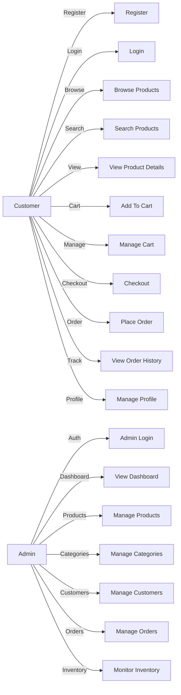
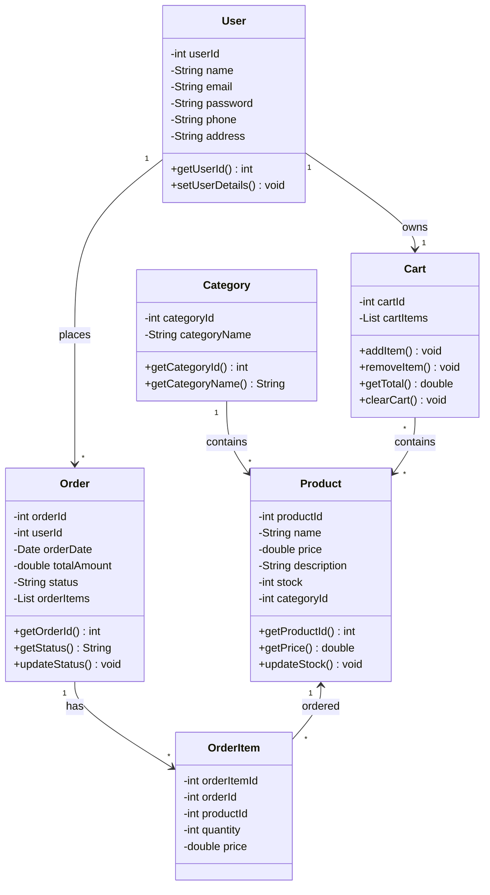
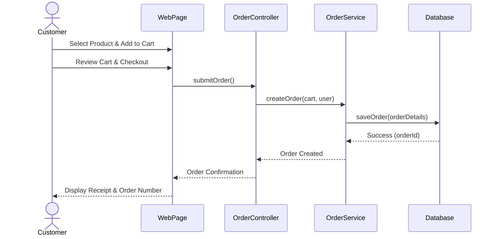
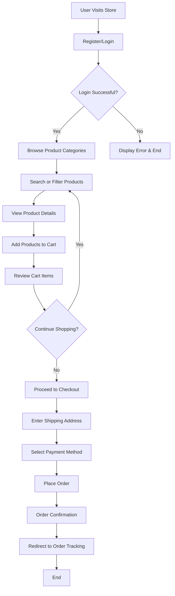

# HK Fashion Store

A comprehensive Java-based e-commerce platform for seamless online fashion shopping. This project demonstrates modern web development practices using the MVC architecture, servlets, JSP, and MySQL.

## 📋 Table of Contents

- [Overview](#overview)
- [Features](#features)
- [Technology Stack](#technology-stack)
- [System Architecture](#system-architecture)
- [Project Structure](#project-structure)
- [Database Design](#database-design)
- [Installation & Setup](#installation--setup)
- [Usage Guide](#usage-guide)
- [UML Diagrams](#uml-diagrams)
- [Testing](#testing)
- [Future Enhancements](#future-enhancements)
- [Troubleshooting](#troubleshooting)
- [Contributing](#contributing)
- [License](#license)

---

## 🎯 Overview

HK Fashion Store is a full-stack e-commerce web application that enables customers to browse and purchase fashion products with an intuitive interface. The platform includes comprehensive admin capabilities for managing products, categories, inventory, and customer orders.

The application is built on a **three-tier architecture** (Presentation, Business Logic, and Data Access layers) ensuring scalability, maintainability, and separation of concerns.

---

## ✨ Features

### 👥 Customer Features

- **User Authentication**: Registration and secure login
- **Product Catalog**: Browse all available fashion items
- **Advanced Search & Filtering**: Find products by category, price, and keywords
- **Detailed Product Views**: View comprehensive product information and specifications
- **Shopping Cart Management**: Add, update, or remove items
- **Order Processing**: Complete checkout and order placement
- **Order Tracking**: View order history and status
- **Profile Management**: Update personal information and preferences

### 🛠️ Admin Features

- **Admin Dashboard**: Comprehensive overview of store metrics
- **Product Management**: Create, update, and delete products
- **Category Management**: Organize products into categories
- **Customer Management**: View and manage customer accounts
- **Order Management**: Process and track customer orders
- **Inventory Monitoring**: Real-time stock level tracking
- **Secure Access**: Admin-only login portal

---

## 🛠️ Technology Stack

| Layer | Technologies |
|-------|--------------|
| **Frontend** | HTML5, CSS3, JavaScript, Bootstrap 4/5 |
| **Backend** | Java - Servlets, JSP (Java Server Pages) |
| **Database** | MySQL 5.7+ |
| **Server** | Apache Tomcat 9+ |
| **Build Tools** | Maven (pom.xml) |
| **Development** | Eclipse IDE / IntelliJ IDEA, Git & GitHub |
| **Database Tools** | XAMPP, MySQL Workbench |

### Language Composition

The repository consists of:

| Language | Purpose |
|----------|---------|
| **Java** | Backend business logic, servlets, DAOs, and controllers |
| **CSS** | Styling and UI design for frontend components |
| **HTML** | JSP templating and markup structure |

---

## 🏗️ System Architecture

The application follows a **three-tier architecture** pattern:

```
┌─────────────────────────────────────┐
│         Client / Browser            │
│    (User Interface Layer)           │
│    HTML / CSS                       │
└──────────────┬──────────────────────┘
               │
               ▼
┌─────────────────────────────────────┐
│    JSP Pages & Frontend Assets      │
│    (Presentation Layer)             │
│    HTML + CSS + JavaScript          │
└──────────────┬──────────────────────┘
               │
               ▼
┌─────────────────────────────────────┐
│      Java Servlets & Services       │
│    (Business Logic Layer)           │
│  - Request Processing               │
│  - Business Rules & Validation      │
└──────────────┬──────────────────────┘
               │
               ▼
┌─────────────────────────────────────┐
│      DAO (Data Access Objects)      │
│    (Persistence Layer)              │
│  - Database Operations              │
└──────────────┬──────────────────────┘
               │
               ▼
┌─────────────────────────────────────┐
│       MySQL Database                │
│    (Data Storage Layer)             │
└─────────────────────────────────────┘
```

### Layer Responsibilities

| Layer | Role | Primary Language |
|-------|------|------------------|
| **Presentation** | Handles all user interactions through JSP pages, HTML forms, and frontend components | HTML, CSS, JavaScript |
| **Business Logic** | Processes application logic, validates data, manages workflows using Java Servlets and service classes | Java |
| **Data Access** | Communicates with MySQL database through DAO classes, handles CRUD operations | Java |

---

## 📁 Project Structure

```
HKFashionStore/
├── src/                              # Java source code
│   ├── controller/                   # Servlet controllers handling HTTP requests
│   ├── dao/                          # Data Access Objects for database operations
│   ├── model/                        # Entity classes (User, Product, Order, etc.)
│   ├── service/                      # Business logic services
│   └── util/                         # Utility classes (database connection, helpers)
│
├── WebContent/                       # Web resources (JSP, CSS, JS, images)
│   ├── css/                          # Stylesheets
│   ├── js/                           # JavaScript files
│   ├── images/                       # Image assets
│   ├── admin/                        # Admin panel JSP pages
│   └── user/                         # User-facing JSP pages
│
├── database/                         # Database scripts
│   └── hkfashionstore.sql           # SQL initialization script
│
├── README.md                         # Project documentation
├── pom.xml                           # Maven configuration
└── .gitignore                        # Git ignore rules
```

---

## 🗄️ Database Design

### Entity Relationship Model

```
User
├── user_id (PK)
├── name
├── email
├── password
├── phone
└── address
    ├──┐ 1:N
       ▼
    Order
    ├── order_id (PK)
    ├── user_id (FK)
    ├── total_amount
    ├── order_date
    └── status
        ├──┐ M:N
           ▼
        Product
        ├── product_id (PK)
        ├── name
        ├── description
        ├── price
        ├── stock
        └── category_id (FK)
            │
            └──◄── 1:N ──┐
                      Category
                      ├── category_id (PK)
                      └── category_name
```

### Table Schemas

#### Users Table

| Field | Type | Constraints |
|-------|------|-------------|
| user_id | INT | PRIMARY KEY, AUTO_INCREMENT |
| name | VARCHAR(100) | NOT NULL |
| email | VARCHAR(100) | NOT NULL, UNIQUE |
| password | VARCHAR(255) | NOT NULL |
| phone | VARCHAR(15) | - |
| address | TEXT | - |
| created_at | TIMESTAMP | DEFAULT CURRENT_TIMESTAMP |

#### Products Table

| Field | Type | Constraints |
|-------|------|-------------|
| product_id | INT | PRIMARY KEY, AUTO_INCREMENT |
| name | VARCHAR(150) | NOT NULL |
| description | TEXT | - |
| price | DECIMAL(10,2) | NOT NULL |
| stock | INT | NOT NULL |
| category_id | INT | FOREIGN KEY |
| created_at | TIMESTAMP | DEFAULT CURRENT_TIMESTAMP |

#### Categories Table

| Field | Type | Constraints |
|-------|------|-------------|
| category_id | INT | PRIMARY KEY, AUTO_INCREMENT |
| category_name | VARCHAR(100) | NOT NULL, UNIQUE |

#### Orders Table

| Field | Type | Constraints |
|-------|------|-------------|
| order_id | INT | PRIMARY KEY, AUTO_INCREMENT |
| user_id | INT | FOREIGN KEY, NOT NULL |
| total_amount | DECIMAL(10,2) | NOT NULL |
| order_date | DATE | NOT NULL |
| status | VARCHAR(50) | DEFAULT 'Pending' |

#### Order_Items Table

| Field | Type | Constraints |
|-------|------|-------------|
| order_item_id | INT | PRIMARY KEY, AUTO_INCREMENT |
| order_id | INT | FOREIGN KEY, NOT NULL |
| product_id | INT | FOREIGN KEY, NOT NULL |
| quantity | INT | NOT NULL |
| price | DECIMAL(10,2) | NOT NULL |

---

## 📊 UML Diagrams

### Use Case Diagram



### Class Diagram



### Sequence Diagram – Order Placement



### Activity Diagram – Customer Journey



---

## 🚀 Installation & Setup

### Prerequisites

Before starting, ensure you have the following installed:

- **Java JDK 8+** - [Download](https://www.oracle.com/java/technologies/javase-downloads.html)
- **Apache Tomcat 9+** - [Download](https://tomcat.apache.org/)
- **MySQL Server 5.7+** - [Download](https://dev.mysql.com/downloads/mysql/)
- **IDE** - Eclipse IDE or IntelliJ IDEA (optional but recommended)
- **Git** - Version control system

### Step 1: Clone the Repository

```bash
git clone https://github.com/KHari07/HKFashion-Source.git
cd HKFashion-Source
```

### Step 2: Import Project into IDE

**Eclipse:**
1. File → Import → General → Existing Projects into Workspace
2. Select the cloned directory
3. Click Finish

**IntelliJ IDEA:**
1. File → Open → Select the project directory
2. Configure JDK and Tomcat in Project Settings

### Step 3: Create MySQL Database

Open MySQL Command Line or MySQL Workbench and run:

```sql
CREATE DATABASE hkfashionstore;
USE hkfashionstore;
```

### Step 4: Import SQL Schema

```bash
mysql -u root -p hkfashionstore < database/hkfashionstore.sql
```

Or import the SQL file through MySQL Workbench:
1. MySQL Workbench → File → Open SQL Script
2. Select `database/hkfashionstore.sql`
3. Execute the script

### Step 5: Configure Database Connection

Create or update `src/util/DBConnection.java`:

```java
public class DBConnection {
    private static final String DB_URL = "jdbc:mysql://localhost:3306/hkfashionstore";
    private static final String DB_USER = "root";
    private static final String DB_PASSWORD = "your_password"; // Change this
    private static final String DB_DRIVER = "com.mysql.jdbc.Driver";
    
    public static Connection getConnection() throws SQLException, ClassNotFoundException {
        Class.forName(DB_DRIVER);
        return DriverManager.getConnection(DB_URL, DB_USER, DB_PASSWORD);
    }
}
```

### Step 6: Configure Tomcat Server

1. **Eclipse:**
   - Window → Preferences → Server → Runtime Environments
   - Click Add → Apache Tomcat v9.0
   - Select Tomcat installation directory

2. **IntelliJ IDEA:**
   - Run → Edit Configurations → Add New Configuration → Tomcat Server
   - Select Local → Configure Tomcat path

### Step 7: Deploy Application

**Eclipse:**
1. Right-click project → Run As → Run on Server
2. Select Apache Tomcat v9.0

**IntelliJ IDEA:**
1. Run → Run 'Tomcat Server'

### Step 8: Access the Application

Open your browser and navigate to:

```
http://localhost:8080/HKFashionStore
```

---

## 💻 Usage Guide

### For Customers

1. **Registration**: Create a new account with email and password
2. **Browse**: Explore products by category or search for specific items
3. **Shopping**: Add items to cart and adjust quantities
4. **Checkout**: Review cart, enter shipping address, and place order
5. **Track Orders**: View order history and current order status

### For Administrators

1. **Login**: Access admin panel at `/admin/login.jsp`
2. **Dashboard**: View sales metrics and inventory status
3. **Manage Products**: Add new products, update prices, and manage stock
4. **Manage Orders**: Process orders and update status
5. **Monitor Inventory**: Track low-stock items and reorder

---

## ✅ Testing

### Functional Testing

- [ ] User registration with validation
- [ ] Login authentication and session management
- [ ] Product search and filtering functionality
- [ ] Shopping cart add/remove/update operations
- [ ] Order checkout process
- [ ] Admin product management CRUD operations
- [ ] Order status updates

### Integration Testing

- [ ] Database connectivity and transactions
- [ ] Servlet-DAO integration
- [ ] Service layer business logic
- [ ] Order processing workflow
- [ ] User authentication flow

### System Testing

- [ ] End-to-end customer journey
- [ ] Admin workflow validation
- [ ] Data consistency across operations
- [ ] Session management
- [ ] Error handling and recovery

### Test Scenarios

**Customer Registration Test:**
- Valid email format
- Password strength validation
- Duplicate email prevention
- Phone number format validation

**Order Placement Test:**
- Cart item persistence
- Inventory deduction
- Order confirmation
- Email notification (future)

---

## 🔮 Future Enhancements

| Feature | Priority | Status |
|---------|----------|--------|
| Online Payment Gateway Integration (Stripe, PayPal) | High | ⏳ Planned |
| Email Notifications | High | ⏳ Planned |
| Product Recommendation System | Medium | ⏳ Planned |
| Wishlist Functionality | Medium | ⏳ Planned |
| AI-Based Fashion Suggestions | Medium | 🔄 In Research |
| Mobile Application (Android/iOS) | High | ⏳ Planned |
| Inventory Analytics Dashboard | Medium | ⏳ Planned |
| Multi-Vendor Support | Low | ⏳ Planned |
| Customer Reviews & Ratings | Medium | ⏳ Planned |
| Advanced Search with AI | Low | 🔄 In Research |
| Two-Factor Authentication (2FA) | High | ⏳ Planned |
| Internationalization (Multi-language Support) | Low | ⏳ Planned |

---

## 🐛 Troubleshooting

### Common Issues & Solutions

#### Issue: "Connection refused" to MySQL

**Solution:**
```bash
# Ensure MySQL server is running
# Windows
net start MySQL80

# macOS
brew services start mysql

# Linux
sudo service mysql start

# Verify connection
mysql -u root -p
```

#### Issue: Tomcat Not Starting

**Solution:**
- Check if port 8080 is already in use: `netstat -an | grep 8080`
- Verify JAVA_HOME environment variable is set
- Check Tomcat logs: `catalina.out`

#### Issue: "404 Not Found" Error

**Solution:**
- Verify application name matches the URL: `http://localhost:8080/HKFashionStore`
- Ensure project is deployed correctly to Tomcat
- Check if JSP pages exist in `WebContent` directory

#### Issue: Database Connection Fails

**Solution:**
- Verify MySQL credentials in `DBConnection.java`
- Check if database `hkfashionstore` exists
- Ensure MySQL JDBC driver is in classpath
- Check MySQL server status

#### Issue: JSP Pages Display as Text

**Solution:**
- Ensure Tomcat is properly configured in IDE
- Verify file extensions are `.jsp` not `.html`
- Restart Tomcat server
- Clear browser cache

### Debug Mode

Enable debug logging in `util/Logger.java`:

```java
public class Logger {
    public static final boolean DEBUG = true; // Set to true for debugging
    
    public static void log(String message) {
        if (DEBUG) {
            System.out.println("[LOG] " + message);
        }
    }
}
```

---

## 🤝 Contributing

Contributions are welcome! Please follow these guidelines:

1. **Fork** the repository
2. **Create** a feature branch: `git checkout -b feature/your-feature`
3. **Commit** changes with clear messages: `git commit -m "Add feature: description"`
4. **Push** to your branch: `git push origin feature/your-feature`
5. **Submit** a Pull Request with a detailed description

### Code Standards

- Follow Java naming conventions (camelCase for variables/methods, PascalCase for classes)
- Add meaningful comments for complex logic
- Maintain consistent indentation (4 spaces)
- Write unit tests for new features
- Update documentation as needed

---

## 📄 License

This project is licensed under the **MIT License** - see the LICENSE file for details.

This project is intended for **educational and learning purposes** in computer science and web development.

---

## 👥 Authors & Team

**Project Lead:** KHari07

**Developed as:** Academic/Industrial Project

**Last Updated:** June 2026

---

## 📞 Support & Contact

For issues, questions, or suggestions:

* **GitHub Issues:** [Report an Issue](https://github.com/KHari07/HKFashion-Source/issues)
* **Email:** [Contact the project maintainers](mailto:harikrishnak202020@gmail.com)

---

## 📚 Additional Resources

- [Java Servlet Documentation](https://docs.oracle.com/cd/E17802_01/products/products/servlet/index.html)
- [JSP Tutorial](https://www.oracle.com/java/technologies/jsp.html)
- [MySQL Documentation](https://dev.mysql.com/doc/)
- [Apache Tomcat Documentation](https://tomcat.apache.org/tomcat-9.0-doc/)
- [Bootstrap Documentation](https://getbootstrap.com/docs/)

---

**Happy Coding! 🚀**
