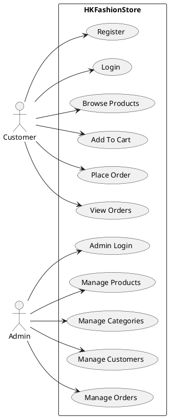
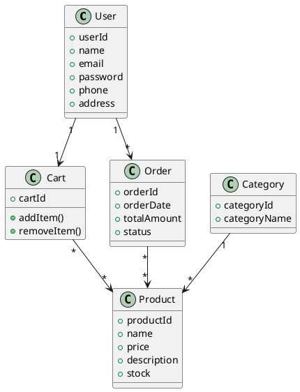
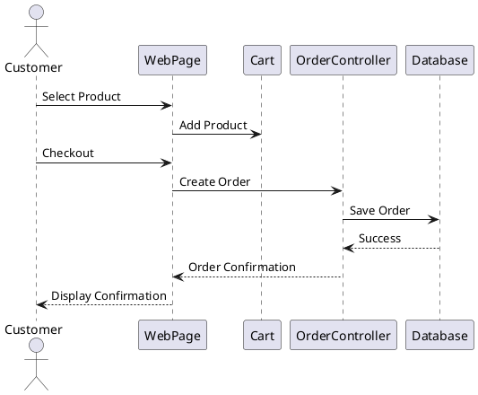
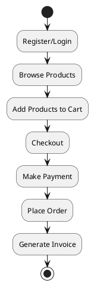

# HK Fashion Store

## Overview

HK Fashion Store is a web-based e-commerce application developed to provide users with a seamless online shopping experience for fashion products. The system allows customers to browse products, manage shopping carts, place orders, and track purchases. Administrators can manage products, categories, customers, and orders through a dedicated management interface.

The application follows the MVC (Model-View-Controller) architecture and is built using Java-based web technologies.

---

## Features

### Customer Features

* User Registration and Login
* Product Browsing
* Product Search and Filtering
* Product Details View
* Shopping Cart Management
* Order Placement
* Order History Tracking
* Profile Management

### Admin Features

* Secure Admin Login
* Product Management (Add, Update, Delete)
* Category Management
* Customer Management
* Order Management
* Inventory Monitoring
* Dashboard Overview

---

## Technology Stack

### Frontend

* HTML5
* CSS3
* JavaScript
* Bootstrap

### Backend

* Java Servlets
* JSP (Java Server Pages)

### Database

* MySQL

### Server

* Apache Tomcat

### Development Tools

* Eclipse IDE / IntelliJ IDEA
* Git & GitHub
* XAMPP/MySQL Server

---

## System Architecture

The application follows a three-tier architecture:

### Presentation Layer

Handles user interactions through JSP pages and frontend components.

### Business Layer

Processes application logic using Java Servlets and service classes.

### Data Access Layer

Communicates with the MySQL database through DAO classes.

```text
+------------------+
|    Client/User   |
+--------+---------+
         |
         v
+------------------+
| JSP / Frontend   |
+--------+---------+
         |
         v
+------------------+
| Java Servlets    |
| Business Logic   |
+--------+---------+
         |
         v
+------------------+
| DAO Layer        |
+--------+---------+
         |
         v
+------------------+
| MySQL Database   |
+------------------+
```

---

## Project Structure

```text
HKFashionStore/
│
├── src/
│   ├── controller/
│   ├── dao/
│   ├── model/
│   ├── service/
│   └── util/
│
├── WebContent/
│   ├── css/
│   ├── js/
│   ├── images/
│   ├── admin/
│   └── user/
│
├── database/
│   └── hkfashionstore.sql
│
├── README.md
└── pom.xml
```

---

## Database Design

### User

| Field    | Type    |
| -------- | ------- |
| user_id  | INT     |
| name     | VARCHAR |
| email    | VARCHAR |
| password | VARCHAR |
| phone    | VARCHAR |
| address  | TEXT    |

### Product

| Field       | Type    |
| ----------- | ------- |
| product_id  | INT     |
| name        | VARCHAR |
| description | TEXT    |
| price       | DECIMAL |
| stock       | INT     |
| category_id | INT     |

### Category

| Field         | Type    |
| ------------- | ------- |
| category_id   | INT     |
| category_name | VARCHAR |

### Order

| Field        | Type    |
| ------------ | ------- |
| order_id     | INT     |
| user_id      | INT     |
| total_amount | DECIMAL |
| order_date   | DATE    |
| status       | VARCHAR |

---

# UML Diagrams

## Use Case Diagram



---

## Class Diagram



---

## Sequence Diagram – Order Placement



---

## Activity Diagram



---

## Installation Guide

### Prerequisites

* Java JDK 8 or Higher
* Apache Tomcat 9+
* MySQL Server
* Eclipse IDE / IntelliJ IDEA

### Setup Steps

1. Clone the repository

```bash
git clone https://github.com/your-repository/HKFashionStore.git
```

2. Import project into Eclipse/IntelliJ.

3. Create MySQL Database

```sql
CREATE DATABASE hkfashionstore;
```

4. Import SQL file.

5. Configure database credentials.

```java
DB_URL=jdbc:mysql://localhost:3306/hkfashionstore
DB_USER=root
DB_PASSWORD=password
```

6. Deploy project to Tomcat.

7. Start Tomcat Server.

8. Open browser:

```text
http://localhost:8080/HKFashionStore
```

---

## Future Enhancements

* Online Payment Gateway Integration
* Product Recommendation System
* AI-Based Fashion Suggestions
* Wishlist Functionality
* Mobile Application Support
* Email Notifications
* Inventory Analytics Dashboard
* Multi-Vendor Support

---

## Testing

### Functional Testing

* Login Validation
* Registration Validation
* Product Search
* Cart Operations
* Checkout Process

### Integration Testing

* Database Connectivity
* Servlet-DAO Integration
* Order Processing

### System Testing

* End-to-End User Flow

---

## Conclusion

HK Fashion Store is a complete e-commerce platform designed to streamline online fashion shopping. The project demonstrates the implementation of Java web technologies, MVC architecture, database management, and software engineering principles. The system provides a scalable foundation for future enhancements and real-world deployment.

---

## Authors

Developed as an Academic/Industrial Project.

HK Fashion Store Team

---

## License

This project is intended for educational and learning purposes.
